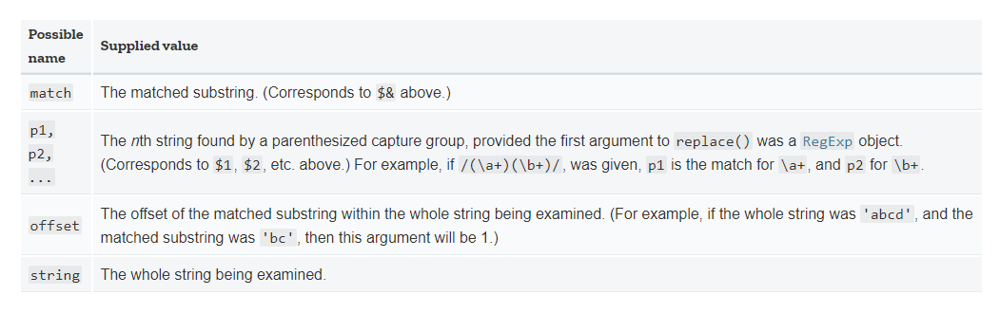
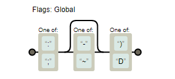

# CodeWars系列


## 8kyu

### String repeat

> Write a function called `repeatString` which repeats the given String `src` exactly `count` times.
>
> ```javas
> repeatStr(6, "I") // "IIIIII"
> repeatStr(5, "Hello") // "HelloHelloHelloHelloHello"
> ```


#### 思路

首先想到的是`Array`、`Array.prototype.fill`和`Array.prototype.join`方法。但是看别人用的最多的是`String.prototype.repeat(n)`方法。

#### 代码

- Array.prototype.fill

```javascript
function repeatStr (n, s) {
  return Array(n).fill(s).join('');
}
```


- String.prototype.repeat

```javascript
function repeatStr (n, s) {
  return s.repeat(n);
}
```


### Reversed Strings

> Complete the solution so that it reverses the string value passed into it.
>
> ```javascript
> solution('world'); // returns 'dlrow'
> ```


#### 思路

利用`Array.prototype.reverse`，需要先将字符串转换为数组。

#### 代码

```javascript
function solution(str){
  return str.split('').reverse().join('');
}
```


### Keep Hydrated!

> Nathan loves cycling.
>
> Because Nathan knows it is important to stay hydrated, he drinks 0.5 litres of water per hour of cycling.
>
> You get given the time in hours and you need to return the number of litres Nathan will drink, rounded to the smallest value.
>
> For example:
>
> time = 3 ----> litres = 1
>
> time = 6.7---> litres = 3
>
> time = 11.8--> litres = 5

#### 思路

可以使用`parseInt`或者`Math.floor`静态方法进行向下取整，也可以利用逻辑运算隐式转换为整数。

#### 代码

- 逻辑隐式转换

```javascript
function litres(time) {
  return time/2|0;
}
```


- parseInt

```javascript
function litres(time) {
  return parseInt(time*0.5);
}
```


### Square(n) Sum

> Complete the square sum function so that it squares each number passed into it and then sums the results together.
>
> For example, for `[1, 2, 2]` it should return `9` because `1^2 + 2^2 + 2^2 = 9`.

#### 思路

map&reduce

#### 代码

```javascript
function squareSum(numbers){
  return numbers.map(x=>x**2).reduce((s,x)=>s+x,0);
}
```


### Convert a String to a Number!

> Note: This kata is inspired by [Convert a Number to a String!](http://www.codewars.com/kata/convert-a-number-to-a-string/). Try that one too.
>
> ## Description
>
> We need a function that can transform a string into a number. What ways of achieving this do you know?
>
> Note: Don't worry, all inputs will be strings, and every string is a perfectly valid representation of an integral number.
>
> ## Examples
>
> ```javascript
> stringToNumber("1234") == 1234
> stringToNumber("605" ) == 605
> stringToNumber("1405") == 1405
> stringToNumber("-7"  ) == -7
> ```

#### 思路

利用定义的转换函数，或者隐式的ToNumber转换。`parseInt`、`Number`、`+str`、`str|0`等操作。

#### 代码

```javascript
var stringToNumber = function(str){
  // put your code here
  return +str;
}
```


### Count the Monkeys!

> You take your son to the forest to see the monkeys. You know that there are a certain number there (n), but your son is too young to just appreciate the full number, he has to start counting them from 1.
>
> As a good parent, you will sit and count with him. Given the number (n), populate an array with all numbers up to and including that number, but excluding zero.
>
> For example:
>
> ```javascript
> monkeyCount(10) // --> [1, 2, 3, 4, 5, 6, 7, 8, 9, 10]
> monkeyCount(1) // --> [1]
> ```

#### 思路

利用`Array`,`Array.prototype.fill`,`Arrayp.prototype.map`方式生成数组。不过看别人最好的方法应该是使用`Array.from`静态方法因为其中包含了mapFn。

#### 代码

- Array、fill、map

```javascript
function monkeyCount(n) {
// your code here
  return Array(n).fill(0).map((x,i)=>i+1);
}
```

- Array.from

```javascript
function monkeyCount(n) {
// your code here
  return Array.from({length:n},(x,i)=>i+1);
}
```

### Reversed Words

> Complete the solution so that it reverses all of the words within the string passed in.
>
> Example:
>
> ```javascript
> reverseWords("The greatest victory is that which requires no battle")
> // should return "battle no requires which that is victory greatest The"
> ```

#### 思路

按照空格分隔并倒转。

- 时间复杂度On，空间On

#### 代码

```javascript
function reverseWords(str){
  return str.split(' ').reverse().join(' '); // reverse those words
}
```

### If you can't sleep, just count sheep!!

> If you can't sleep, just count sheep!!
>
> ## Task:
>
> Given a non-negative integer, `3` for example, return a string with a murmur: `"1 sheep...2 sheep...3 sheep..."`. Input will always be valid, i.e. no negative integers.

#### 思路

使用`Array.from`静态方法创建数组，提供映射函数，其中使用`Template Literals`，然后使用`Array.prototype.join`方法拼接。

- 时间On，空间On

#### 代码

```javascript
var countSheep = function (num){
  //your code here
  return Array.from({length:num},(x,i)=>`${i+1} sheep...`).join('');
}
```

### Reversed sequence

> Get the number n `(n>0)` to return the reversed sequence from n to 1.
>
> Example : n=5 >> [5,4,3,2,1]

#### 思路

生成数组，提供映射函数。

- 时间On，空间On

```javascript
const reverseSeq = n => {
  return Array.from({length:n},(x,i)=>n-i);
};
```

### To square(root) or not to square(root)

> \#To square(root) or not to square(root)
>
> Write a method, that will get an integer array as parameter and will process every number from this array.
> Return a new array with processing every number of the input-array like this:
>
> ```
> If the number has an integer square root, take this, otherwise square the number.
> 
> [4,3,9,7,2,1] -> [2,9,3,49,4,1]
> ```
>
> The input array will always contain only positive numbers and will never be empty or null.
>
> The input array should not be modified!
>
> Have fun coding it and please don't forget to vote and rank this kata! :-)
>
> I have also created other katas. Take a look if you enjoyed this kata!

##### 思路

映射即可。

- 时间On，空间On

#### 代码

```javascript
function squareOrSquareRoot(array) {
  return array.map(x=>{
    let tmp=Math.sqrt(x)|0;
    return tmp**2===x?tmp:x**2;
  });  
}
```


## 7kyu

### Get the Middle Character

> You are going to be given a word. Your job is to return the middle character of the word. If the word's length is odd, return the middle character. If the word's length is even, return the middle 2 characters.
>
> \#Examples:
>
> ```
> Kata.getMiddle("test") should return "es"
> 
> Kata.getMiddle("testing") should return "t"
> 
> Kata.getMiddle("middle") should return "dd"
> 
> Kata.getMiddle("A") should return "A"
> ```
>
> \#Input
>
> A word (string) of length `0 < str < 1000` (In javascript you may get slightly more than 1000 in some test cases due to an error in the test cases). You do not need to test for this. This is only here to tell you that you do not need to worry about your solution timing out.
>
> \#Output
>
> The middle character(s) of the word represented as a string.

#### 思路

利用`String.prototype.substr`方法。

- 时间O1，空间O1

#### 代码

```javascript
function getMiddle(s)
{
  //Code goes here!
  return s.substr((s.length-1)/2|0,s.length%2?1:2);
}
```

### Isograms

> An isogram is a word that has no repeating letters, consecutive or non-consecutive. Implement a function that determines whether a string that contains only letters is an isogram. Assume the empty string is an isogram. Ignore letter case.
>
> ```javascript
> isIsogram("Dermatoglyphics") == true
> isIsogram("aba") == false
> isIsogram("moOse") == false // -- ignore letter case
> ```

#### 思路

使用集合，如果产生的集合大小比原字符串小，则存在重复的。

- 时间On，空间On

#### 代码

```javascript
function isIsogram(str){
  return new Set(str.toLowerCase()).size===str.length;
}
```

### Singleton Pattern

> n software engineering, the singleton pattern is a design pattern that restricts the instantiation of a class to one object. This is useful when exactly one object is needed to coordinate actions across the system.
>
> Create an Singleton pattern, so there is one object in system.
>
> Example:
>
> ```javascript
> var obj1 = new Singleton();
> var obj2 = new Singleton();
> obj1 === obj2; // => true
> obj1.test = 1;
> obj2.test; // => 1
> ```

#### 思路

可以使用闭包来保存单例。

#### 代码

```javascript
var Singleton = (function(){
  // implement singleton Class
  let instance;
  return function(){
    return instance||(instance=this);
  }
})();
```

### Sum of Odd Cubed Numbers

> Find the sum of the odd numbers within an array, after cubing the initial integers. The function should return `undefined`/`None`/`nil`/`NULL` if any of the values aren't numbers.

#### 思路

筛选计算即可。不过这题了解到了逗号表达式的妙用。`return`只能当做语句而不能当做表达式，那样就能在三元运算符中使用了。

#### 代码

- 解1

```javascript
function cubeOdd(arr) {

// insert code here >.<
  let flag=false;
  let result = arr.filter(n=>Number.isInteger(n)?(Math.abs(n)%2===1):(flag=true,n)).map(x=>x**3).reduce((a,b)=>a+b,0);
  return flag?(void 0):result;
}
```

- 解2

```javascript
function cubeOdd(arr) {
  return arr.every(Number.isInteger)?arr.filter(x=>Math.abs(x)%2===1).reduce((a,b)=>a+b**3,0):void 0;
}
```

### Currying functions: multiply all elements in an array

> To complete this Kata you need to make a function `multiplyAll`/`multiply_all` which takes an array of integers as an argument. This function must return another function, which takes a single integer as an argument and returns a new array.
>
> The returned array should consist of each of the elements from the first array multiplied by the integer.
>
> Example:
>
> ```javascript
> multiplyAll([1, 2, 3])(2) = [2, 4, 6];
> ```
>
> Here's a [nice Youtube video about currying](https://www.youtube.com/watch?v=iZLP4qOwY8I), which might help you if this is new to you.

#### 思路

使用`Array.prototype.map`函数进行映射。

- 时间On，空间O1

#### 代码

```javascript
/* left blank for unlimited creativity :) */
const multiplyAll=arr=>times=>arr.map(x=>x*times);
```

### Sum of a Beach

> Beaches are filled with sand, water, fish, and sun. Given a string, calculate how many times the words `"Sand"`, `"Water"`, `"Fish"`, and `"Sun"` appear without overlapping (regardless of the case).
>
> ## Examples
>
> ```javascript
> sumOfABeach("WAtErSlIde")                    ==>  1
> sumOfABeach("GolDeNSanDyWateRyBeaChSuNN")    ==>  3
> sumOfABeach("gOfIshsunesunFiSh")             ==>  4 
> sumOfABeach("cItYTowNcARShoW")               ==>  0
> ```

#### 思路

global & ignore case。正则匹配。

#### 代码

```javascript
function sumOfABeach(beach) {
  // your code here
  return (beach.match(/(water)|(sand)|(fish)|(sun)/ig)||"").length;
}
```

### Regexp Basics - is it a letter?

> Complete the code which should return `true` if the given object is a single ASCII letter (lower or upper case), `false` otherwise.

#### 思路

在原型链上添加方法，使用this指向当前调用者，正则匹配时调用ToPrimitive转化为字符串。

#### 代码

```javascript
String.prototype.isLetter = function() {
  return /^[a-z]$/i.test(this)
}
```

### Regexp Basics - is it a vowel?

> Implement the function which should return `true` if given object is a vowel (meaning `a, e, i, o, u`), and `false` otherwise.

#### 思路

正则匹配。

#### 代码

```javascript
String.prototype.vowel = function() {
  return /^[aeiou]$/i.test(this);
};
```

### Hide password from jdbc url

> We have to create a function that receives a connection string with password included and you have to mask the password i.e. change password by asterisks.
>
> Preconditions:
>
> - non empty valid url
> - password always next to string section `password=`
> - assume password will not contain ampersand sign for sake of simplicity
> - to make it more real it has non ASCII characters
> - "password=" and "user" will occur only once
>
> > empty passwords are not validated but best solutions take empty passwords into account
>
> Example:
>
> ------
>
> ## input
>
> > ```
> > jdbc:mysql://sdasdasdasd:szdasdasd:dfsdfsdfsdf/sdfsdfsdf?user=root&password=12345
> > ```
>
> ## output
>
> > ```
> > jdbc:mysql://sdasdasdasd:szdasdasd:dfsdfsdfsdf/sdfsdfsdf?user=root&password=*****
> > ```
>
> Extra readings:
>
> <https://alvinalexander.com/java/jdbc-connection-string-mysql-postgresql-sqlserver>

#### 思路

正则匹配querystring的password部分，以`password`开头截止到`&`或者字符串尾结束。

#### 代码

```javascript
function hidePasswordFromConnection(urlString){
  return urlString.replace(/password=[^&]*/g,x=>`password=${'*'.repeat(x.length-9)}`);
}
```

### Coding Meetup #1 - Higher-Order Functions Series - Count the number of JavaScript developers coming from Europe

> You will be given an array of objects (hashes in ruby) representing data about developers who have signed up to attend the coding meetup that you are organising for the first time.
>
> Your task is to **return the number of JavaScript developers coming from Europe**.
>
> For example, given the following list:
>
> ```javascript
> var list1 = [
>   { firstName: 'Noah', lastName: 'M.', country: 'Switzerland', continent: 'Europe', age: 19, language: 'JavaScript' },
>   { firstName: 'Maia', lastName: 'S.', country: 'Tahiti', continent: 'Oceania', age: 28, language: 'JavaScript' },
>   { firstName: 'Shufen', lastName: 'L.', country: 'Taiwan', continent: 'Asia', age: 35, language: 'HTML' },
>   { firstName: 'Sumayah', lastName: 'M.', country: 'Tajikistan', continent: 'Asia', age: 30, language: 'CSS' }
> ];
> ```
>
> your function should return number `1`.
>
> If, there are no JavaScript developers from Europe then your function should return `0`.
>
> Notes:
>
> - The format of the strings will always be `Europe` and `JavaScript`.
> - All data will always be valid and uniform as in the example above.

#### 思路

reduce统计。

#### 代码

```javascript
function countDevelopers(list) {
  // your awesome code here :)
  return list.reduce((count,x)=>x.continent==='Europe'&&x.language==='JavaScript'?count+1:count,0)
}
```


## 6kyu

### Find the odd int

> Given an array, find the integer that appears an odd number of times.
>
> There will always be only one integer that appears an odd number of times.

#### 思路

利用异或的交换律，两个相同数异或为0,0与任何数异或等于任何数。

- 时间复杂度On，空间O1

#### 代码

```javascript
function findOdd(A) {
  //happy coding!
  return A.reduce((last,cur)=>last^cur);
}
```

### Convert string to camel case

> Complete the method/function so that it converts dash/underscore delimited words into camel casing. The first word within the output should be capitalized **only** if the original word was capitalized (known as Upper Camel Case, also often referred to as Pascal case).
>
> ## Examples
>
> ```javascript
> toCamelCase("the-stealth-warrior") // returns "theStealthWarrior"
> 
> toCamelCase("The_Stealth_Warrior") // returns "TheStealthWarrior"
> ```

#### 思路

使用正则表达式和`String.prototype.replace`。正则表达式匹配下划线和后续字母。`String.prototype.replace`参数如下：

```javascript
var newStr = str.replace(regexp|substr, newSubstr|function)
```

- 第一个参数是正则表达式或者子字符串，子字符串只匹配第一次出现。
- 第二个参数是新的替换子字符串或者替换函数。如果使用正则表达式全局模式则每次匹配都会调用一次替换函数，返回值是要替换的新函数。替换函数第一个参数是匹配到的子串，剩下的参数是捕获组捕获的内容，最后两个参数是匹配字符串首字符下标`offset`和原字符串`string`



#### 代码

```javascript
function toCamelCase(str){
  return str.replace(/(_|-)[a-z]/ig,x=>x[1].toUpperCase())
}
```

### Count the smiley faces!

> Description:
> Given an array (arr) as an argument complete the function `countSmileys` that should return the total number of smiling faces.
> Rules for a smiling face:
> -Each smiley face must contain a valid pair of eyes. Eyes can be marked as `:` or `;`
> -A smiley face can have a nose but it does not have to. Valid characters for a nose are `-` or `~`
> -Every smiling face must have a smiling mouth that should be marked with either `)` or `D`.
> No additional characters are allowed except for those mentioned.
> **Valid smiley face examples:**
> `:) :D ;-D :~)`
> **Invalid smiley faces:**
> `;( :> :} :]`
>
> **Example cases:**
>
> ```javascript
> countSmileys([':)', ';(', ';}', ':-D']);       // should return 2;
> countSmileys([';D', ':-(', ':-)', ';~)']);     // should return 3;
> countSmileys([';]', ':[', ';*', ':$', ';-D']); // should return 1;
> ```
>
> Note:
>
>  In case of an empty array return 0. You will not be tested with invalid input (input will always be an array). Order of the face (eyes, nose, mouth) elements will always be the same
>
> ### Happy coding!

#### 思路

使用正则表达式。眼睛必须有，鼻子不必须有，嘴必须有。。



#### 代码

```javascript
//return the total number of smiling faces in the array
function countSmileys(arr) {
  return arr.reduce((count,x)=>/[:;][-~]?[\)D]/g.test(x)+count,0)
}
```

### Dashatize it

> Given a number, return a string with dash`'-'`marks before and after each odd integer, but do not begin or end the string with a dash mark.
>
> Ex:
>
> ```javascript
> dashatize(274) -> '2-7-4'
> dashatize(6815) -> '68-1-5'
> ```

#### 思路

正则表达式，将数组字符串化，然后匹配奇数，将其替换。替换时可能会产生重复（例如相邻的两个奇数）。最后将首尾多余的dash删除。

#### 代码

- v1

```javascript
function dashatize(num) {
  if(num<10&&num>-10) return Math.abs(num)+'';
  return num.toString().replace(/[13579]/g,x=>`-${x}-`).replace(/^-|--|-$/g,x=>x.length===2?'-':'');
}
```

- v2，优化后

```javascript
function dashatize(num) {
  return num.toString().replace(/[13579]/g,x=>`-${x}-`).replace(/--/g,'-').replace(/^-|-$/g,'');
}
```

### Valid Phone Number

> Write a function that accepts a string, and returns true if it is in the form of a phone number.
> Assume that any integer from 0-9 in any of the spots will produce a valid phone number.
>
> Only worry about the following format:
> (123) 456-7890 (don't forget the space after the close parentheses)
>
> Examples:
>
> ```j
> validPhoneNumber("(123) 456-7890")  =>  returns true
> validPhoneNumber("(1111)555 2345")  => returns false
> validPhoneNumber("(098) 123 4567")  => returns false
> ```

#### 思路

正则表达式。

#### 代码

```javascript
function validPhoneNumber(phoneNumber){
  return /^\(\d{3}\) \d{3}-\d{4}$/g.test(phoneNumber);
}
```


## 5kyu

### Simple Events

> Your goal is to write an **Event** constructor function, which can be used to make **event** objects.
>
> An **event** object should work like this:
>
> - it has a **.subscribe()** method, which takes a function and stores it as its handler
> - it has an **.unsubscribe()** method, which takes a function and removes it from its handlers
> - it has an **.emit()** method, which takes an arbitrary number of arguments and calls all the stored functions with these arguments
>
> As this is an elementary example of events, there are some simplifications:
>
> - all functions are called with correct arguments (*e.g.* only functions will be passed to unsubscribe)
> - you should not worry about the order of handlers' execution
> - the handlers will not attempt to modify an event object (*e.g.* add or remove handlers)
> - the context of handlers' execution is not important
> - each handler will be subscribed at most once at any given moment of time. It can still be unsubscribed and then subscribed again
>
> Also see an example test fixture for suggested usage

#### 思路

观察者模式。使用`Set`来保存和删除添加的Handler。emit时调用所有注册的Handler。

#### 代码

```javascript
function Event() {
  this.handlers=new Set();
}
Event.prototype.subscribe=function(handler){
  this.handlers.add(handler);
}
Event.prototype.unsubscribe=function(handler){
  this.handlers.delete(handler);
}
Event.prototype.emit=function(...args){
  for(let fn of this.handlers.values()){
    fn(...args);
  }
}
```

### A Chain adding function

> We want to create a function that will add numbers together when called in succession.
>
> ```javascript
> add(1)(2);
> // returns 3
> ```
>
> We also want to be able to continue to add numbers to our chain.
>
> ```javascript
> add(1)(2)(3); // 6
> add(1)(2)(3)(4); // 10
> add(1)(2)(3)(4)(5); // 15
> ```
>
> and so on.
>
> A single call should return the number passed in.
>
> ```javascript
> add(1); // 1
> ```
>
> We should be able to store the returned values and reuse them.
>
> ```javascript
> var addTwo = add(2);
> addTwo; // 2
> addTwo + 5; // 7
> addTwo(3); // 5
> addTwo(3)(5); // 10
> ```
>
> We can assume any number being passed in will be valid whole number.

#### 思路

通过观察上述`addTwo`函数既可以当数值也可以调用，因此可以通过`valueOf`方法返回所求数值。

#### 代码

```javascript
function add(n){
  const helper=x=>add(n+x);
  helper.valueOf=()=>n;
  return helper;
}
```


## 4kyu

### Advanced Events

> This excercise is a more sophisticated version of [Simple Events](http://www.codewars.com/dojo/katas/52d3b68215be7c2d5300022f/) kata.
>
> Your task is to implement an **Event** constructor function for creating event objects
>
> ```javascript
> var event = new Event();
> ```
>
> which comply to the following:
>
> - an **event** object should have **.subscribe()** and **.unsubscribe()** methods to add and remove handlers
> - **.subscribe()** and **.unsubscribe()** should be able take an arbitrary number of arguments and tolerate invalid arguments (not functions, or for **unsubscribe**, functions which are not subscribed) by simply skipping them
> - multiple subscription of the same handler is allowed, and in this case unsubscription removes the last subscription of the same handler
> - an **event** object should have an **.emit()** method which must invoke all the handlers with the arguments provided
> - **.emit()** should use its own invocation context as handers' invocation context
> - the order of handlers invocation must match the order of subscription
>
> - handler functions can subscribe and unsubscribe handlers, but the changes should only apply to the next **emit** call - the handlers for an ongoing **emit** call should not be affected
>   - **subscribe**, **unsubscribe** and **emit** are the only public properties that are allowed on **event** objects (apart from **Object.prototype** methods)
>
> Check the test fixture for usage example

#### 思路

这题值32分！指定用function形式来写，不过想尝试一下class，和别人代码相比自己好捞。下面是要点和难点，本题有时间会额外写一篇博客记录。

- 整体还是观察者模式
- 要求只公开`subscribe`，`unsubscribe`和`emit`方法，因此可以利用JS的闭包，使用模块模式，构造函数中返回对象。
- handler里可能会继续触发subscribe和unsubscribe，但对于本次emit不起作用，应用到下次emit。

#### 代码

```javascript
class Event{
  constructor(){
    let fns=[];
    let copy=[];
    let emitting=false;
    return {
      subscribe(...handlers){
        for(let fn of handlers){
          if(!fn instanceof Function) continue;
          copy.push(fn);
          if(emitting) return;
          fns.push(fn);
        }
      },
      unsubscribe(...handlers){
        for(let fn of handlers){
          if(!fn instanceof Function) continue;
          let idx=copy.lastIndexOf(fn);
          if(idx<0) continue;
          copy.splice(idx,1);
          if(emitting) return;
          fns.splice(idx,1);
        }
      },
      emit(...args){
        emitting=true;
        
        for(let fn of fns){
          if(fn instanceof Function){
            fn.call(this,...args);
          }
        }
        fns=[...copy];
        emitting=false;
      }
    }
  }
  
}
```

