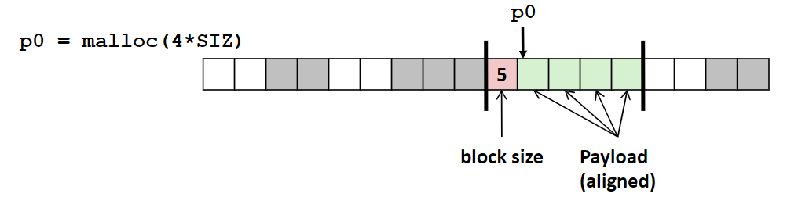
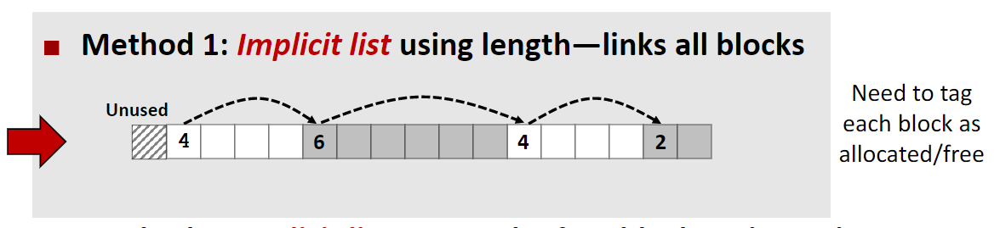
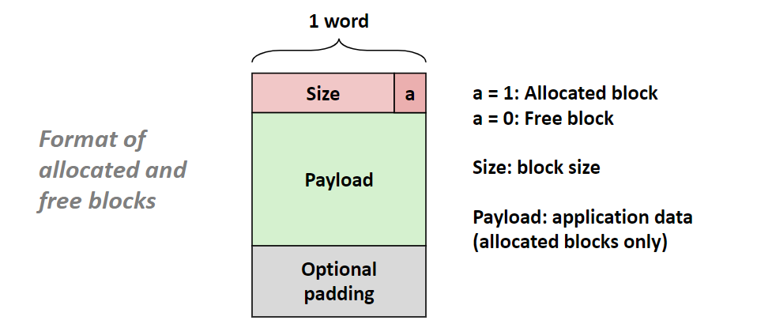
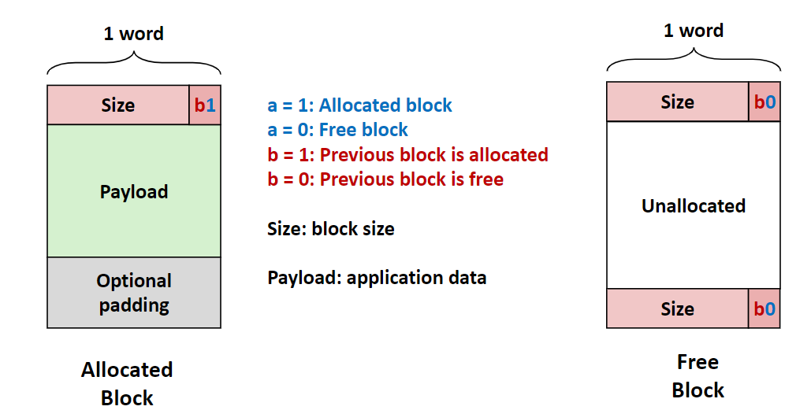
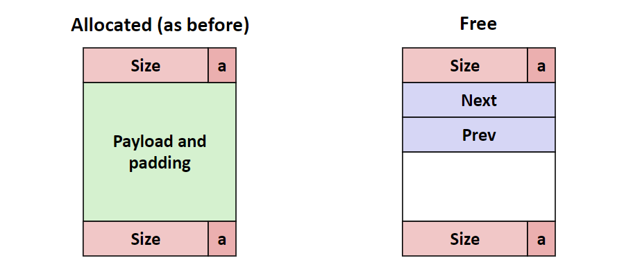
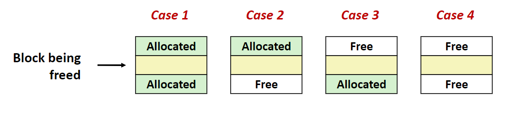
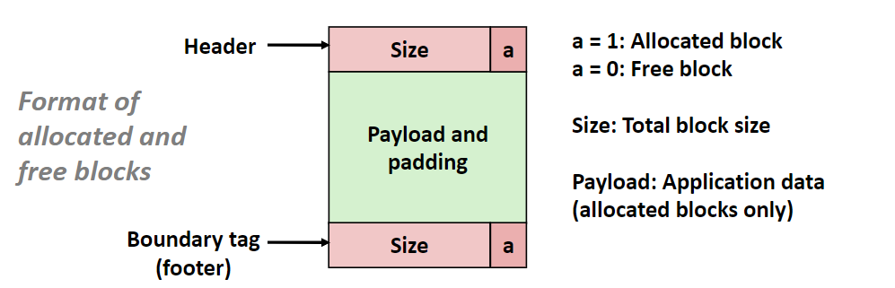
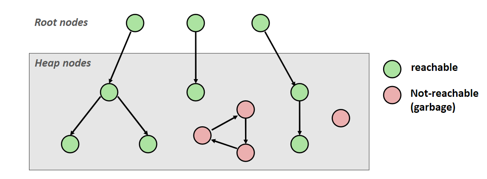
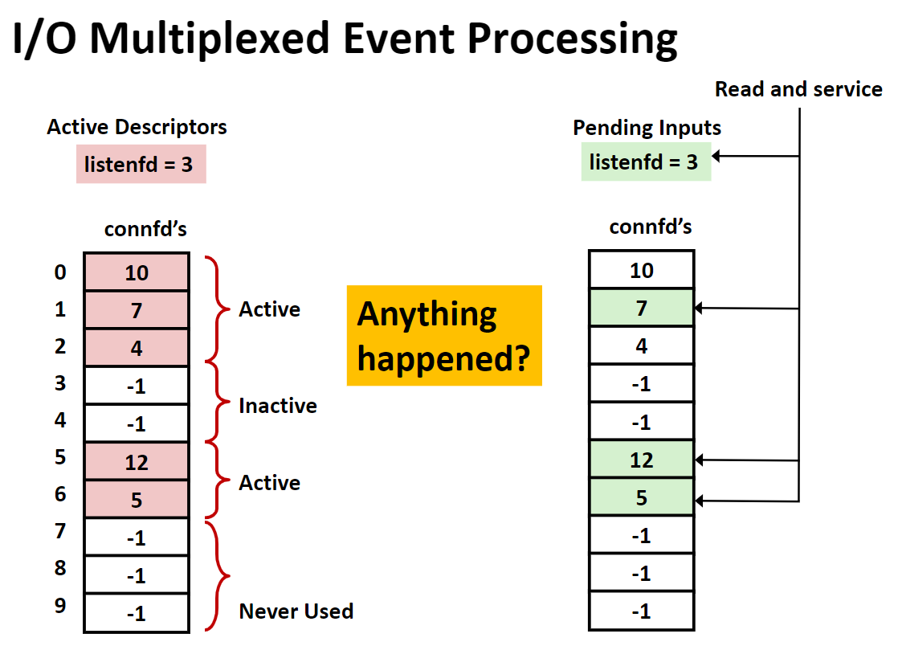
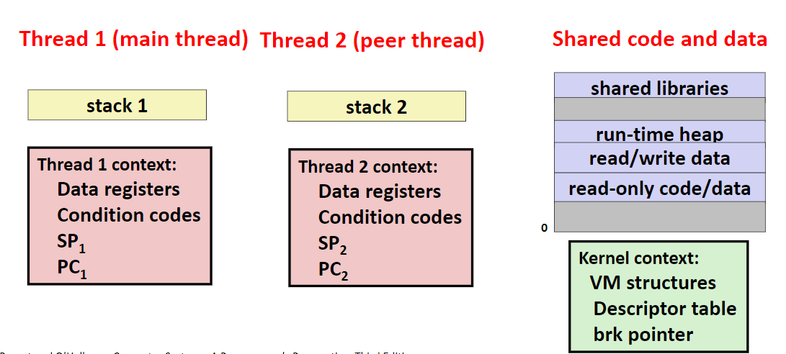

# 计算机系统

## 内存管理

### 内存分配

**内存分配和释放的最佳实践是分离链表加平衡二叉搜索树，实际上可以看做是一个HashMap**

> 提高处理内存申请和释放操作的吞吐量（单位时间满足请求），提高内存利用率（减少内部碎片和外部碎片）。两者不可能同时很好满足，需要适当衡量。

#### 需要解决的问题

##### 0x01. free内存时，如何通过指针获取该内存块的大小？

需要额外的空间。通过在申请块的头部（header field）字添加标记，标记此区域的大小



##### 0x02. 如何记录未被分配的块？

一共有4种方法。

- 隐式链表（申请需要O(n)复杂度，实际不会使用，可能用于特殊程序）

  > 连接所有的块。需要标记当前块是已分配的还是空闲的。

  


  


  **优化后：**


  

- 显示链表

  > 只连接空闲块。需要额外的块来存储指针。




- 单独的链表记录（Segregated free list）

  > 不同大小量级的块记录到不同的链表中，申请时酌情分配。。

- 平衡二叉树（eg.红黑树）记录

  > 平衡的二分查找树（BBST）存储。key是大小，value是地址

##### 0x03. 如何找到一个合适的空闲块来满足申请的请求（隐式链表示例）

常见三种方式

- 首次匹配

  > 每次都从链表开始搜索满足申请的空闲块，遇到第一个合适的块就分配。实际应用中链表开始会碎片化。

- 二次匹配

  > 每次查找都从上次完成申请时的块开始搜索，遇到第一个合适的就分配。比首次分配更快，因为不用重复搜搜无用块。实际可能碎片化更严重。

- 最佳匹配

  > 遍历链表，找到满足的最小块，然后分配。这样提高了内存利用率。大多数情况比首次分配要慢。

##### 0x04.  释放内存块后的合并问题

**合并策略：**

- 立即合并：free时合并
- 推迟合并：外部碎片太多时合并；malloc需要块时合并

**一些合并情况：**

- 对于情况1，修改为空闲，直接释放。
- 对于情况2，修改为空闲，合并后续块，并修改大小
- 对于情况3，需要知道前驱块的大小才能合并
- 对于情况4，也需要知道前驱块大小才能合并




对于情况3和4，需要修改块的结构。



> 类似双向链表，这样可以通过上一个块的尾部来反向访问隐式链表了。


**进一步优化，已申请的块不需要尾部**

> 利用块大小是4字的整数倍的块，低2位空闲。将这两位当做标志位。


### 垃圾回收

#### 主要问题

- 内存管理器如何知道哪些内存时可以清理的

  > 如果没有指针指向他，那么这块内存就不能被使用。


#### 可以把内存看做一个有向图

- 每个内存块是一个结点
- 每个指针是一条边
- 不在堆里的结点称为根节点。（可能是全局变量、寄存器变量、栈中的变量）
- 如果可以从根节点到达堆里的某个节点，那么称这个堆里的节点是可达的
- 如果堆中的节点无法通过任意一个根节点到达，那么是不可达的




#### 典型垃圾回收算法


##### 0x01. 标记清除（Mark & Sweep）

> 用一个标记位来标记内存块

1. 标记：对于所有根节点，从根节点开始标记所有可达的内存块
2. 清除：清除所有未被标记的内存块

Mark&Sweep代码

- Mark

``` c
//对于每个根节点，都执行一遍
ptr mark(ptr p){
    if(!is_ptr(p)) return;//如果不是指针类型，直接返回
    if(markBitSet(p)) return;//如果已经标记，则返回
    setMarkBit(p);//标记
    for(i=0;i<length(p);i++)//该节点内部的所有指针，DFS标记
        mark(p[i]);
    return;
}
```

- Sweep

```c
//遍历堆
ptr sweep(ptr p,ptr end){
    while(p<end){//遍历堆中所有对象
        if(markBitSet(p))//如果已经标记则清除标记
            clearMarkBit();
        else if(allocateBitSet(p))//否则，如果该区域是allocated则free
            free(p);
        p+=length(p);//下一个内存块
    }
}
```


##### 0x02. 引用计数 （Reference counting）

##### 0x03. 复制算法（Copying collection）

##### 0x04. 分代收集器（Generational Collectors）

> 基于生命周期的


## IO

- 所有外设都看做文件
- 描述符表（进程独有）->打开文件表（所有进程共享）->v-node表（所有进程共享）
  - 描述符表表项用文件描述符索引；每个描述符表表项指向打开文件表的一个表项，这个表项记录了当前打开的文件的状态；每个打开文件表表项指向v-node表表项。
  - 硬盘上相同的文件可能对应多个打开文件表表项，比如open两次相同文件并读取，两个读取位置不同，读取位置记录在打开文件表表项中。
  - 两个描述符表项最终引用相同的文件可以用来实现文件共享。
  - v-node表表项存了文件的状态
- 啊


### IO多路复用

> 笔记源于时间驱动的服务器，区别于进程和线程的服务器

- 服务器维护活动连接的集合（array of connfd's）
- 循环：
  - 判断哪个描述符connfd或listenfd有pending的数据输入
    - eg，利用select函数
    - pending就是一个事件
  - 如果listenfd有输入，那就accept
    - 将新的connfd加入到连接集合中
  - 给所有pending的提供服务




## 并发


### 线程

> 可类比进程

- 每个线程 都有自己的逻辑控制流
- 每个线程共享同样的代码、数据和内核上下文
- 每个线程都有自己的栈和局部变量
  - 不会隔离其他线程，其他线程有可能会访问
- 每个线程都有一个tid




