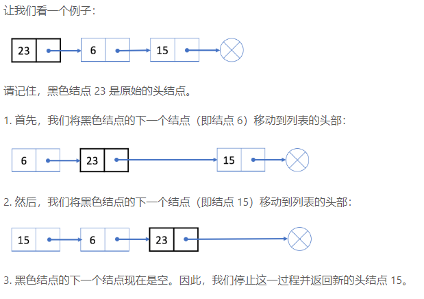

## 简单数据结构和应用

[TOC]

### 目录

##### 队列和栈

- 队列和广度优先搜索
- 广度优先搜索和Dijkstra
- 栈和表达式计算
- 栈和深度优先搜索
- 队列实现栈
- 栈实现队列

##### 数组和字符串

- 双指针技巧

##### 链表

- 翻转链表

##### 哈希表

- 哈希集
- 哈系映射
- 哈希映射键的设计


---


### 队列和栈

##### 队列和广度优先搜索

- 算法
  1. `根节点入队并标记已访问`
  2. `当前队列所有节点（每个节点记为A）出队，依次访问节点A`
  3. `如果A为目标节点，结束返回；否则4`
  4. `当前节点A邻居节点入队并标记已访问`
  5. `继续执行2，直到所有出队的节点（新入队的不算）处理完`
  6. `继续执行2，直到队列为空`

- 例子：[《岛屿数量》](https://leetcode-cn.com/problems/number-of-islands/)

##### 广度优先搜索和Dijkstra

> - 简单广度优先搜索是图的所有边权值都为1的情况下的搜索。
>
> - Dijkstra处理的图（更一般图）更多的是权值为不等的。
>
> - 简单BFS每次入队的是一个层次（距离根节点距离相等的且相对剩余节点最近的）所有节点
> - 更一般图每次入队的也是距离根节点相对剩余节点最近的（可以看做每层节点数只有一个，省去了队列）


- 算法
  1. 定义访问集visited、最短距离向量distance
  2. 根节点（源节点）加入visited，更新distance
  3. 获取未加入visited节点的distance最小的节点A
  4. 将A加入visited，更新distance（更新规则：distance中未加入visited的节点D=min{D的当前值，distance[A]+A到D的距离}）
- 代码

```c++
#include <iostream>
#include <string>
#include <set>

using namespace std;

unsigned MAX_D = (-1U);

void dijkstra(unsigned a[][5], int count, int src)
{
    set<int> visited;

    unsigned *distance = new unsigned[count];
    for (size_t i = 0; i < count; i++)
    {
        distance[i] = MAX_D;
    }
    distance[src] = 0;
    visited.insert(src);


// 获取每个节点的最短路径，BFS，每一次循环获得一个节点的最短距离
    for (size_t i = 0; i < count; i++)
    {
        if (i==src)
        {
            continue;
        }
        // 找到距离根节点最短且未被计算过得节点
        unsigned min_d=MAX_D,min_i=0;
        for (size_t j = 0; j < count; j++)
        {
            if (visited.count(j)>0)
            {
                continue;
            }

            if (distance[j]<min_d)
            {
                min_d=distance[j];
                min_i=j;
            }
            
        }
        visited.insert(min_i);
        // 更新距离向量
        for (size_t i = 0; i < count; i++)
        {
            if (visited.count(i)>0)
            {
                continue;
            }
            if (a[min_i][i]==MAX_D)
            {
                continue;
            }
            
            distance[i]=min(distance[i],distance[min_i]+a[min_i][i]);
            
        }
        
        
    }
    for (size_t i = 0; i < count; i++)
    {
        std::cout << distance[i] << std::endl;
    }
    
}

unsigned min(unsigned a, unsigned b)
{
    return a > b ? b : a;
}

int main()
{
    unsigned a[5][5]={
        {0,1,2,MAX_D,MAX_D},
        {1,0,MAX_D,5,MAX_D},
        {2,MAX_D,0,2,6},
        {MAX_D,5,2,0,MAX_D},
        {MAX_D,MAX_D,6,MAX_D}
    };
    dijkstra(a,5,0);
    return 0;
}
```


##### 栈和表达式求值

- 中缀表达式转后缀表达式

  `中缀表达式字符串从左向右扫描每个对象A：`

  1. `对象A为数字：直接输出；`
  2. `对象A为左括号：入栈；`
  3. `对象A为右括号：弹栈并输出直到左括号（括号不必输出）`
  4. `对象A为运算符，则和栈顶运算符B比较优先级：`
     1. `若B的优先级小，则将A压栈`
     2. `若B的优先级大于等于A，弹栈输出直到B的优先级小于A，然后将A压栈`
  5. `栈内剩余运算符弹出并输出`

- 后缀表达式计算

  `后缀表达式字符串从左向后扫描每个对象A：`

  1. `对象A为数字：压栈`
  2. `对象A为符号x：依次弹栈得到a和b，计算bxa结果压栈`
  3. `后缀表达式读取完毕，弹栈输出`


##### 栈和深度优先搜索

- 算法

  1. `根节点压栈`
  2. `弹栈得到节点A`
  3. `如果节点为A目标，则结束返回；否则4`
  4. `将A的每个邻居节点标记为已访问并按次序压栈`
  5. `执行2，直到栈空`

- 例子：[《树的中序遍历》]()

  ```c++
  /**
   * Definition for a binary tree node.
   * struct TreeNode {
   *     int val;
   *     TreeNode *left;
   *     TreeNode *right;
   *     TreeNode(int x) : val(x), left(NULL), right(NULL) {}
   * };
   */
  class Solution {
  public:
      vector<int> inorderTraversal(TreeNode* root) {
          set<TreeNode*> visited;
          stack<TreeNode*> s;
          vector<int> result;
          if(!root) return result;
          s.push(root);
          while(!s.empty()){
              TreeNode* cur=s.top();
              s.pop();
              if(!cur) continue;
              if(visited.find(cur)==visited.end()){
                  visited.insert(cur);
                  s.push(cur->right);
                  s.push(cur);
                  s.push(cur->left);
              }
              else{
                  result.push_back(cur->val);
              }
          }
          return result;
      }
  };
  ```


##### 队列实现栈

- 算法

  用两个队列S[2]

  - 压栈操作
    1. 入队S[0]
  - 弹栈操作
    1. S[0]出队直到剩一个元素A，出队的元素依次入队S[1]
    2. S[0]中最后一个元素A出队并返回
    3. 切换S[0]和S[1]的作用

- 代码

  ```c++
  class MyStack {
      queue<int> q[2];
      int index=0;
  public:
      void changeIndex(){
          index=(index+1)%2;
      }
      /** Initialize your data structure here. */
      MyStack() {
          
      }
      
      /** Push element x onto stack. */
      void push(int x) {
          q[index].push(x);
      }
      
      /** Removes the element on top of the stack and returns that element. */
      int pop() {
          while(q[index].size()!=1){
              q[(index+1)%2].push(q[index].front());
              q[index].pop();
          }
          int result = q[index].front();
          q[index].pop();
          changeIndex();
          return result;
          
      }
      
      /** Get the top element. */
      int top() {
          while(q[index].size()!=1){
              q[(index+1)%2].push(q[index].front());
              q[index].pop();
          }
          int result = q[index].front();
          q[(index+1)%2].push(q[index].front());
          q[index].pop();
          changeIndex();
          return result;
      }
      
      /** Returns whether the stack is empty. */
      bool empty() {
          return q[0].empty()&&q[1].empty();
      }
  };
  
  /**
   * Your MyStack object will be instantiated and called as such:
   * MyStack* obj = new MyStack();
   * obj->push(x);
   * int param_2 = obj->pop();
   * int param_3 = obj->top();
   * bool param_4 = obj->empty();
   */
  ```


##### 栈实现队列

- 算法

  两个栈S[2]

  - 入队操作
    1. 压栈到S[0]
  - 出队操作
    1. 如果S[1]为空，则S[0]依次弹栈，弹出的元素依次压栈至S[1]
    2. S[1]弹出元素并返回

- 代码

  ```c++
  class MyQueue {
  private:
      stack<int> s;
      stack<int> q;
  public:
      /** Initialize your data structure here. */
      MyQueue() {
          
      }
      
      /** Push element x to the back of queue. */
      void push(int x) {
          s.push(x);
      }
      
      /** Removes the element from in front of queue and returns that element. */
      int pop() {
          int result = peek();
          q.pop();
          return result;
      }
      
      /** Get the front element. */
      int peek() {
          if(q.empty()){
              while(!s.empty()){
                  q.push(s.top());
                  s.pop();
              }
          }
          return q.top();
      }
      
      /** Returns whether the queue is empty. */
      bool empty() {
          return q.empty()&&s.empty();
      }
  };
  
  /**
   * Your MyQueue object will be instantiated and called as such:
   * MyQueue* obj = new MyQueue();
   * obj->push(x);
   * int param_2 = obj->pop();
   * int param_3 = obj->peek();
   * bool param_4 = obj->empty();
   */
  ```

##### 数组和字符串


- 双指针技巧
  - 情景一——加速迭代（`从两端向中间迭代数组（比如翻转数组）`）
  - 情景二——快指针和慢指针的不同步来解决问题（`给定一个数组和一个值，原地删除改值的所有实例并返回新的长度;判断链表中是否有环（快慢指针肯定相遇第二次）`）

##### 链表

- 反转链表

  - 算法

  > 按原始顺序迭代，并将已翻转列表的后续列表依次放到已翻转列表头部


  


  - 代码

  ```c++
  /**
   * Definition for singly-linked list.
   * struct ListNode {
   *     int val;
   *     ListNode *next;
   *     ListNode(int x) : val(x), next(NULL) {}
   * };
   */
  class Solution {
  public:
      ListNode* reverseList(ListNode* head) {
          ListNode* cur=head,*tmp=head;
          if(!head) return head;
          while(cur->next){
              cur=cur->next;
              tmp->next=cur->next;
              cur->next=head;
              head=cur;
              cur=tmp;
          }
          return head;
      }
  };
  ```


##### 哈希表

- 原理

  > 利用哈希函数将数据转换为索引，以实现快速插入和搜索

- 哈希集

  > 哈希集的存储数据只有一个数value

  - 应用情景

    1. 查重

  - 代码

    ```c++
    struct Node{
        int val;
        Node * next;
        Node(int x):val(x),next(NULL){}
    };
    
    class MyHashSet {
    private:
        Node* set[1000];
    public:
        /** Initialize your data structure here. */
        MyHashSet() {
            for(int i=0;i<1000;i++){
                set[i]=NULL;
            }
        }
        
        void add(int key) {
            int box=key%1000;
            if(!set[box]){
                Node * node = new Node(key);
                set[box]=node;
                return;
            }
            Node * cur=set[box];
            Node * pre=NULL;
            while(cur){
                if(cur->val==key) return;
                pre=cur;
                cur=cur->next;
            }
            Node * node = new Node(key);
            pre->next=node;
        }
        
        void remove(int key) {
            int box=key%1000;
            if(!set[box]){
                return;
            }
            Node * cur=set[box];
            if(cur->val==key){
                set[box]=set[box]->next;
                delete(cur);
                return;
            }
            Node * pre=NULL;
            while(cur){
                if(cur->val==key){
                    pre->next=cur->next;
                    delete(cur);
                    return;
                }
                pre=cur;
                cur=cur->next;
            }
        }
        
        /** Returns true if this set contains the specified element */
        bool contains(int key) {
            int box=key%1000;
            if(!set[box]){
                return false;
            }
            Node * cur=set[box];
            while(cur){
                if(cur->val==key) return true;
                cur=cur->next;
            }
            return false;
        }
    };
    
    /**
     * Your MyHashSet object will be instantiated and called as such:
     * MyHashSet* obj = new MyHashSet();
     * obj->add(key);
     * obj->remove(key);
     * bool param_3 = obj->contains(key);
     */
    ```

- 哈希映射

  > 哈希映射的存储数据是{key,value}键值对

  - 应用情景

    1. 提供更多信息
    2. 按键聚合数据：
       - 属于同一组的所有值都将映射到同一组中。
       - 需要分成不同组的值不会映射到同一组。

  - 代码

    ```c++
    struct Node{
        int key;
        int val;
        Node* next;
        Node(int k,int v):key(k),val(v),next(NULL){}
    };
    
    class MyHashMap {
        
    private:
        Node* map[1000];
        
    public:
        /** Initialize your data structure here. */
        MyHashMap() {
            for(int i=0;i<1000;i++){
                map[i]=NULL;
            }
        }
        
        /** value will always be non-negative. */
        void put(int key, int value) {
            int box=key%1000;
            if(!map[box]){
                Node *node = new Node(key,value);
                map[box]=node;
                return;
            }
            Node*cur=map[box],*pre=NULL;
            while(cur){
                if(cur->key==key){
                    cur->val=value;
                    return;
                }
                pre=cur;
                cur=cur->next;
            }
            Node *node = new Node(key,value);
            pre->next=node;
        }
        
        /** Returns the value to which the specified key is mapped, or -1 if this map contains no mapping for the key */
        int get(int key) {
            int box=key%1000;
            if(!map[box]) return -1;
            Node*cur=map[box];
            while(cur){
                if(cur->key==key){
                    return cur->val;
                }
                cur=cur->next;
            }
            return -1;
            
        }
        
        /** Removes the mapping of the specified value key if this map contains a mapping for the key */
        void remove(int key) {
            int box=key%1000;
            if(!map[box]) return;
            Node*cur=map[box],*pre=NULL;
            if(map[box]->key==key){
                map[box]=map[box]->next;
                delete(cur);
                return;
            }
            while(cur){
                if(cur->key==key){
                    pre->next=cur->next;
                    delete cur;
                    return;
                }
                
                pre=cur;
                cur=cur->next;
            }
        }
    };
    
    /**
     * Your MyHashMap object will be instantiated and called as such:
     * MyHashMap* obj = new MyHashMap();
     * obj->put(key,value);
     * int param_2 = obj->get(key);
     * obj->remove(key);
     */
    ```

- 例子：[《字母异位词分组》](<https://leetcode-cn.com/problems/group-anagrams/>)

  - 算法

    > 利用哈希映射，按键聚合数据，关键是“键”的设计。

  - 代码


```c++
class Solution {
public:
    vector<vector<string>> groupAnagrams(vector<string>& strs) {
        vector<vector<string>> result;
        unordered_map<string,vector<string>> map;
        for(int i=0;i<strs.size();i++){
            string tmp=strs[i];
            sort(tmp.begin(),tmp.end());
            map[tmp].push_back(strs[i]);
        }
        
        for(auto it=map.begin();it!=map.end();it++){
            result.push_back(it->second);
        }
        return result;
        
    }
};
```

