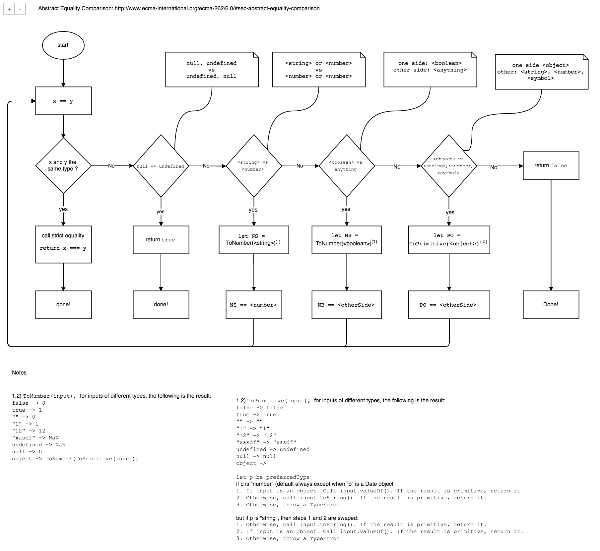

# 计算机系统实例之JS

## 33-concept-js

### 0x01 call stack

### 0x05 “= =” vs “= = =” vs typeof

#### reference:

-  [*== vs === JavaScript: Double Equals and Coercion*](<https://www.codementor.io/javascript/tutorial/double-equals-and-coercion-in-javascript>)
- [**]

### 0x17 原型链和原型继承

> 总结：***没有类，只有对象！***

#### 继承的实现

函数X有个原型对象`prototype`，用X函数创建的对象x有一个对象`__proto__`指向函数X的`prototype`，即`x.__proto__===X.prototype`为true。

假设`Y extends X`：则继承通过：

- **①子类函数Y的`__proto__`指向父类函数X**，
- **②子类函数Y的`prototype`对象里的`__proto__`指向父类函数的`prototype**`

#### 继承后类成员的访问（利用②）

假设有此场景：用某函数Func对象object访问成员属性或方法member。

1. 查看object对象内有没有member成员，如果有则直接访问；没有则下一步
2. 通过object的`__proto__`属性访问创建函数Func的`prototype`属性内有没有member，如果有则直接访问；没有则下一步
3. 通过查看创建函数Func的prototype属性里的`__proto__`来查看更高原型内有无member，往复如此，直到找到，或者到顶层，如果有则访问；没有则undefined(变量) or typeerror(是个函数)

#### 继承后类的静态成员的访问（只能通过函数访问，函数创建的对象无法访问，因为不在链上）（利用①）

假设有此场景：用某函数Func访问静态变量staticMember

1. 查看Func函数下有没有staticMember，如果有则直接访问，否则下一步
2. 通过Func函数下的`__proto__`属性来访问“父类”函数下有没有staticMember，如果有则直接访问，否则下一步
3. 循环往复，直到找到，或者到顶层，有则访问，无则undefined(变量) or typeerror(是个函数)

